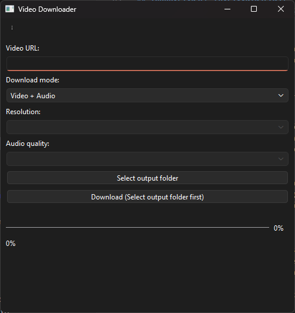
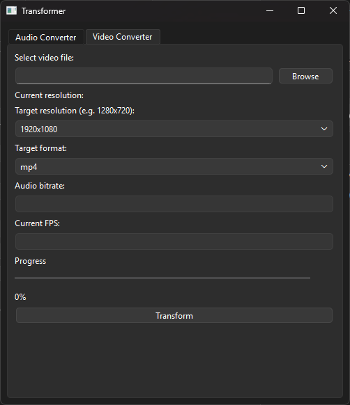

# ZVidDown – Video Downloader

This is a simple, graphical video downloader application that allows you to download videos, audio, or just video from thousands of sites.

## Main Features

- Video + audio download
- Audio only (mp3) download
- Video only download
- Resolution selection (available options)
- Output folder selection
- Download progress indication
- Built-in converter: convert existing audio and video files to other formats, quality, FPS (bitrate, resolution, etc.)
- Wide website support

## Technologies

- Python 3
- PySide6 (graphical interface)
- yt-dlp (video downloading)
- ffmpeg, ffprobe (media processing)

## Screenshots





## Installation and Running

### 1. Pre-compiled version (recommended)

Find the latest version on the following website: https://github.com/zoardgodor/ZVidDown/releases

1. Download `ZVidDown_vX.X_WIN64.zip` or `ZVidDown_vX.X_WIN64_installer.exe`. For Linux, download the AppImage version.
2. For ZIP, extract the archive and run it (for installer, follow the instructions).
3. For `ZVidDown_vX.X_WIN64.zip` (not the installer or AppImage), ffmpeg.exe and ffprobe.exe are already included. But if you want to run main.py directly, they need to be in the same folder as main.py. (On Linux, standard ffmpeg and ffprobe binaries)

(The Installer was created with Inno Setup Compiler)

### 2. Running main.py

Required:
- Python 3
- pip package manager

Install the necessary packages:
```sh
pip install yt-dlp pyside6
```

Run main.py:
```sh
python main.py
```

### 3. Creating your own build (for developers)

Required:
- Python 3
- pip package manager

Install the necessary packages:
```sh
pip install yt-dlp pyside6
```
```sh
pip install pyinstaller
```

Then create the exe according to the make_executable.txt file (available in the repo: https://github.com/zoardgodor/ZVidDown/blob/main/make_executable.txt)

The resulting executable will be in the `dist` folder. Place ffmpeg.exe and ffprobe.exe next to ZVidDown.exe!

## Usage

1. Start the program (`ZVidDown.exe` or the shortcut created by the installer). Or run the AppImage file.
2. Paste the URL of the video you want to download.
3. Select the download mode (video+audio, audio only, video only).
4. Select the resolution (if available).
5. Set the output folder.
6. Click the Download button.
7. If you want to convert an existing audio or video file, open the "Converter" function from the menu (⋮), select the file, set the desired format and quality, then start the conversion. The converted file will be placed in the original folder.

## License
See: LICENSE.txt
BY INSTALLING AND USING THE PROGRAM, YOU ACCEPT THE LICENSE AGREEMENT.

## Multilingual Support (Language Selection)

The program supports multiple languages. By default, you can choose between English and Hungarian.

You can select the language in the three-dot menu (⋮) in the top right corner, under the "Language" menu item. The selected language is saved and remembered after restarting the program.

### Restart the program after you changed the laungage!

### Adding Your Own or Additional Languages

If you want to add more languages, download the `more_languages.json` file and place it in the folder where `main.py` or `ZVidDown.exe` is located.
For the installer, it installs `ZVidDown.exe` to Program Files, you can place the json there.

If this file is present, the program will automatically offer the languages in it in the menu. If not, only the default English and Hungarian are available.

The 'more_languages.json' can be expanded independently.

## Additional Features
- Built-in converter: convert audio and video files to different formats (mp3, ogg, m4a, mp4, mkv, etc.), with options for audio bitrate and video resolution, status bar, and multilingual interface. Also includes FPS changer.

- Before downloading, you must manually select video and audio quality. If either is not selected, a window appears with two options: OK (cancels download) or Continue with default values (downloads bestvideo+bestaudio).
- Audio quality (bitrate/format) can also be selected separately, not just video resolution.
- All subtitles, warnings, and dialog messages are fully translatable. The more_languages.json supports all new text.
- If no video or audio quality is selected, the program does not start automatically, but gives feedback and allows decision.
- Advanced error handling and user feedback for missing or incorrect selections.
- The language system and more_languages.json extend to all new interface and message elements.

**Created by: Gódor Zoárd, developer of ZLockCore**

**Contacts for reporting issues:**

GitHub's built-in issue reporting system
Email: zoard.godor@gmail.com
GitHub: zoardgodor
